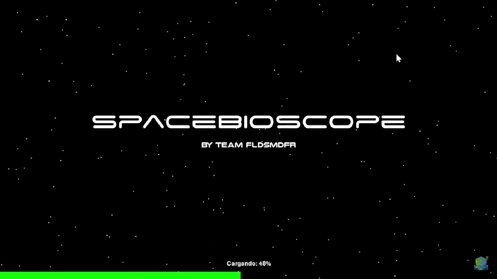

# SpaceBioScope
El proyecto busca facilitar la visualización de experimentos biológicos espaciales, haciendo los datos más accesibles para investigadores y el público general. Utiliza gráficos interactivos que permiten comparar los resultados antes y después de los ensayos, mostrando cambios clave en los sujetos experimentales. Los datos provienen del repositorio "Open Science for Life in Space" de la NASA.

